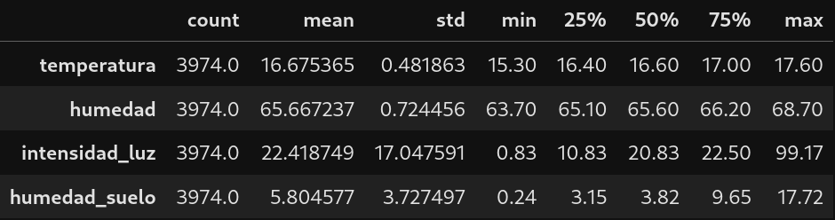
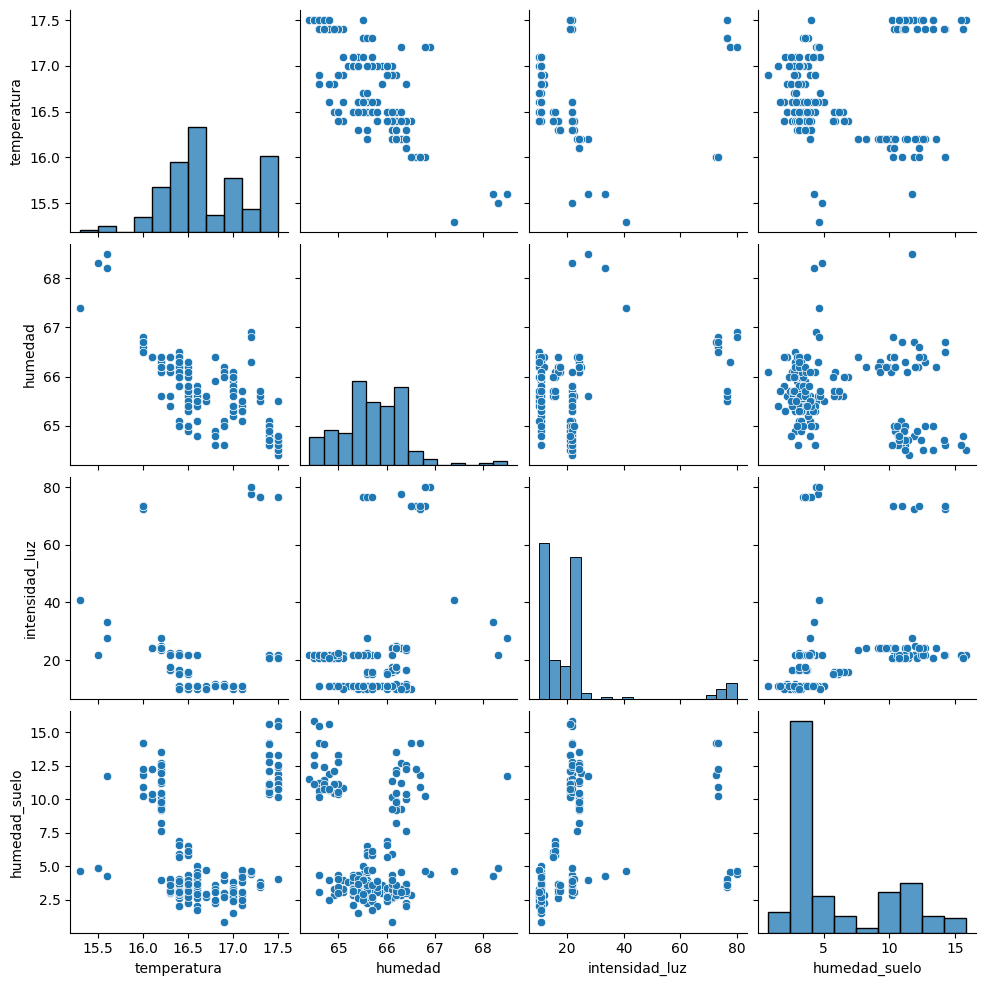
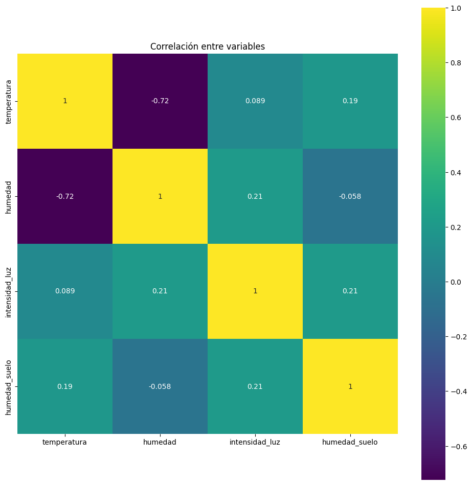
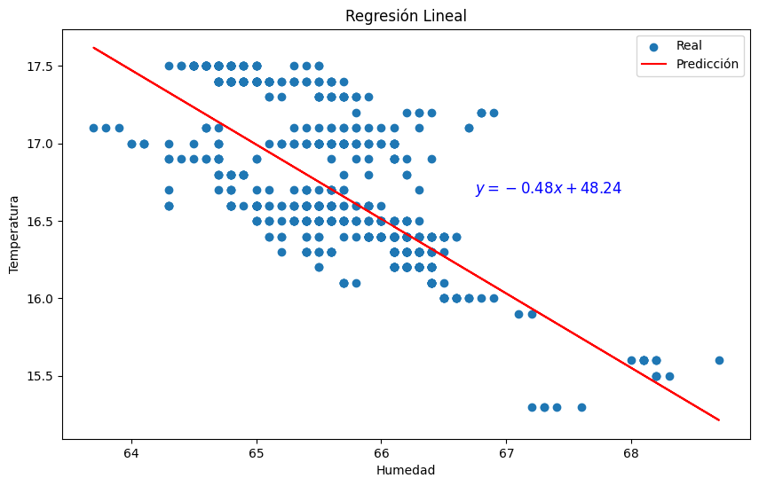

# Análisis de datos

## Diccionario de datos

| Columna|Descripción|Tipo de Datos|Unidades|
|---|---|---|---|
| temperatura	| Temperatura del ambiente | Número decimal | $\textcelsius$|
|humedad|Humedad relativa del ambiente (HR)|Número decimal| %|
|intensidad_luz|Intensidad de luz|Número decimal|lux|
|humedad_suelo|Humedad del suelo|Número decimal|%|

## Estructura de los datos

## Resumen estadístico

## Diagrama de dispersión por pares

* Permite comparar las relaciones entre diferentes pares de variables.  
* Las nubes densas nos indican una fuerte relación entre variables.  
* Si se observara una nube lineal, indicaría una relación positiva o negativa.  
* Se observa una relación lineal entre las variables **humedad** y **temperatura**.

## Correlación entre variables

* Este gráfico nos permite ver de forma visual la correlación entre los atributos.  
* El amarilo alrededor de la diagonal sugiere que los atributos que están uno al lado del otro generalmente están más correlacionados entre sí. 
* Una buena práctica es tomar el valor de 0.7 o -0.7 entre dos atributos o variables para decir que tienen una fuerte correlación o relación.  
* Las variables **humedad** y **temperatura** tienen una fuerte correlación.

## Regresión lineal

* Esta es la regresión lineal entre las variables: **temperatura** y **humedad**.  
* $R^2$=0.537 (Factor de determinación). El 53.7% de la variabilidad en la variable dependiente (temperatura) puede explicarse por el modelo de regresión lineal. Representa una capacidad predictiva moderada.  
* La ecuación es: $y=-0.48x + 48.24$
* La capacidad predictiva moderada y la dispersión de los datos indican poca fiabilidad para predecir mediante una regresión lineal.

