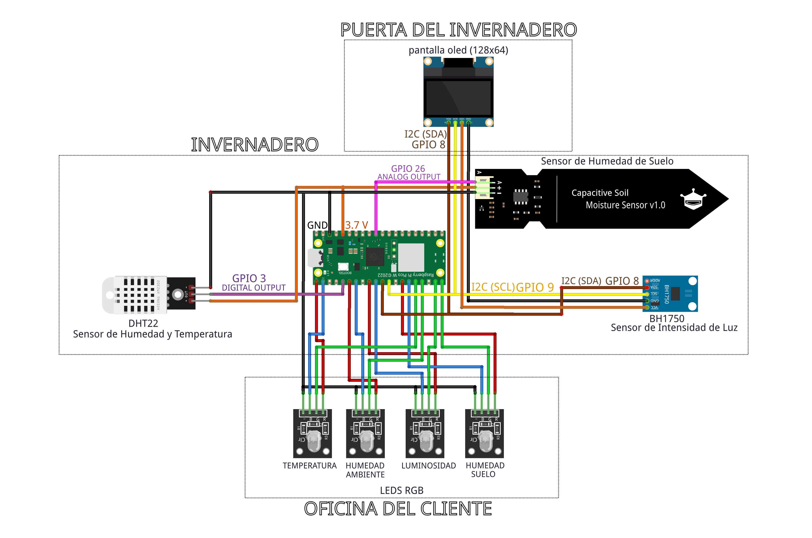

# Componenes Utilizados

* [Raspberry Pi Pico W, placa microcontroladora con capacidad WiFi.](img/picow-pinout.png)
* [Sensor de temperatura y humedad (DHT22).](img/DHT22.png)
* [Sensor de intensidad de luz (BH1750).](img/BH1750.png)
* [Sensor de humedad del suelo.](img/Sensor_humedad_suelo.png)
* [Leds RGB.](img/leds_rgb.png)
* [Pantalla OLED (128x64 píxeles).](img/oled.png)

# Diagrama de Conexión

## El código que contiene la placa Raspberry Pi Pico W

La carpeta "cdg_Raspberry" es justo el código que está dentro del dispositivo hardware Raspberry Pi Pico W, con él se han realizado las pruebas, vídeos y demás.

## Código optimizado para el futuro

La carpeta "micropython_cdg_optimizado" contiene el código de arriba pero revisado y optimizado, pero no se ha podido comprobar ni grabar los vídeos, por lo que se deja para el futuro.

## Carpeta Firmware y reset

Esta carpeta contiene los archivos necesarios para poder resetear a los valores de fábrica la placa Raspberry, y otro archivo para ejecutarlo después para actualizar firmware y que pueda trabajar con microPython.
