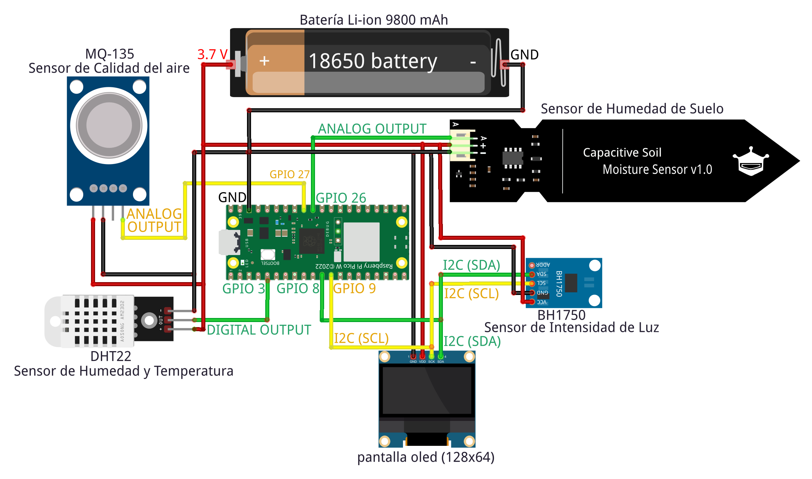

# Componenes Utilizados

* [Raspberry Pi Pico W, placa microcontroladora con capacidad WiFi.](images/picow-pinout.png)
* [Sensor de temperatura y humedad (DHT22).](images/DHT22.png)
* [Sensor de intensidad de luz (BH1750).](images/BH1750.png)
* [Sensor de humedad del suelo.](images/Sensor_humedad_suelo.png)
* [Sensor de calidad del aire (MQ-135).](images/MQ-135.png)
* [Pantalla OLED (128x64 píxeles).](images/oled.png)

# Diagrama de Conexión

